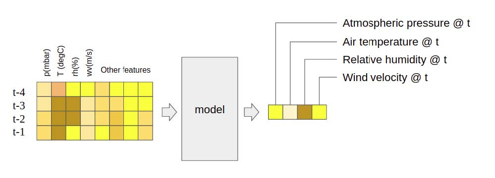
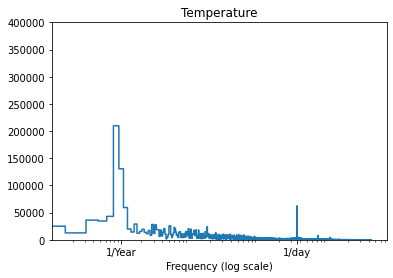
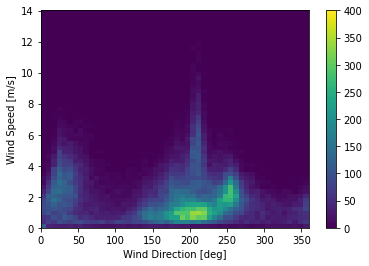
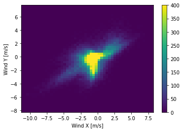
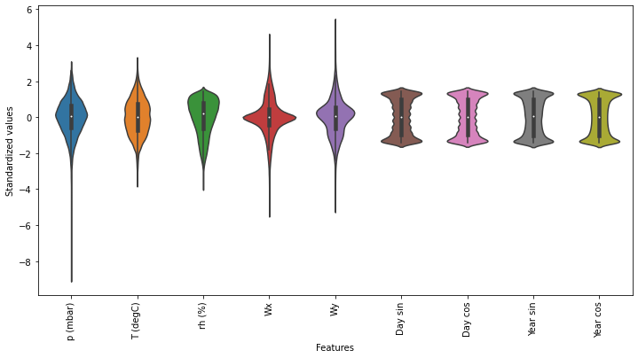
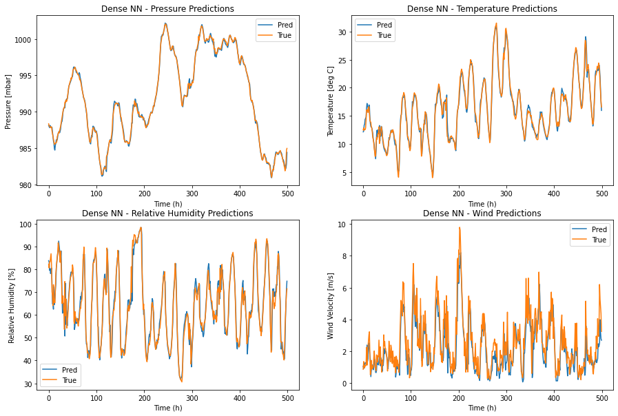
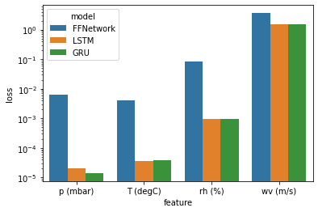
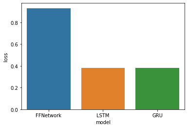
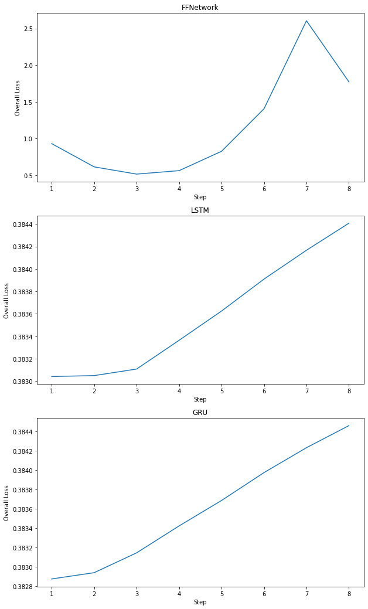
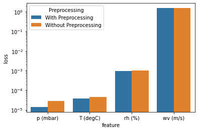

# Weather-Predictions-Using-Deep-Learning

*This project is completed collaboratively by Kuan Wei and Lucas Crea*

The objective of this homework is to create time-series forecasting models for weather predictions. The data-set used is derived from the weather time-series data by the Max Planck Institute for Biogeochemistry from 2009 to 2016. The original data-set has time steps of 10 minutes but was modified to have time steps of 1 hour.

The produced models will output predicted values for atmospheric pressure, air temperature, relative humidify and wind speed (magnitude of the wind velocity vector). The input features will be weather attributes of the previous *k* time steps. The features will, at the minimum, use the atmospheric pressure, air temperature, relative humidify and wind speed.

## Preprocessing

To prepare the data-set for training, several pre-processing steps were taken. Firstly, as the values to be predicted have clear yearly and daily periodicity, time is converted into functions that also have periodicity: sine and cosine waves.

Secondly, in the original dataset, wind direction is represented as vectors. A degree of 360 and a degree of 0 should be the same thing. However, if the direction is represented in degrees as integers, it will be hard for the machine to know that they are similar. Thus, wind speed and wind angles are combined as vectors.

**Orignial Wind Representation:**

**Wind Vector Representation:**

Finally, all features are standardized based on the training data's mean and standard deviation to minimize biases caused by different ranges in different features.

## Key Results

Feedforward Network, LSTM Network, and GRU Network are used in this project. 8 hours data is used to predict the next hour's data. All models had amazing performance on the predictions. The following image illustrates the predicted values vs true values for the Feedforward Network:

Performances for each model are also compared. It can be seen that LSTM Network, and GRU Network have similar performances, while both of them outperform Feedforward Network.

**Performance Comparison For Individual Feature:**

**Overall Performance Comparison:**

For certain time prediction tasks, predicting certain values beyond one-time step ahead is required. In this project, multiple-time-steps predictions can be implemented using the existing models by simply feeding back the predicted values as inputs to get the value at the next time step. However, since the predicted values can never be exact, using the predicted values as the models' input inevitably introduces additional errors. These errors will add up the more the predicted values are used. As such, the further into the future the model attempts to predict, the larger the errors will be. The following figure illustrates how error propagates over time.

The LSTM Network and the GRU Network have steady increases in the error, with about 0.3% rise of overall MSE loss after 8 steps. This increment is not significant, which means that the LSTM Network and the GRU Network handle multiple-time-steps predictions quite well.

Conversely, the feedforward network shows large variations in the overall MSE loss at different time steps. Interestingly, the overall MSE loss decreases from the first time step to the third time step, and from the seventh time step to the eighth time step. One potential reason could be that the FFN model has such a large error band that the predicted values can sometimes seem to be approaching the true values. For example, the error band is +/- 10% and at the first time step the error is +10% while at the second time step, the error is -5%. This would give the impression that the overall prediction has actually gotten better. However, the overall trend of error propagation will show up the further into the future the model predicts. The trend can clearly be observed as the loss at step 7 is 5 times greater than the loss at step 3. This leads to the conclusion that the designed feedforward network performs poorly for multiple-time-steps predictions. 

During the pre-processing, time data was converted into sine and cosine waves, and combined wind speed and wind angle were split into wind vector components. It was blindly assumed that these pre-processing steps would provide meaningful correlations between the features and the targets. Therefore, in this section, the effectiveness of the aggregate of these two pre-processing steps is examined by comparing the MSE losses of each output without them. To do this, the GRU network was also trained with the data without pre-processing, and compared its performance with the GRU network described above. More specifically, for time values integers from 0 to 23 were used to represent the 24 hours of the day, and 1 to 12 to represent the months. For wind speed, the magnitude data was used directly without the angles describing the direction. As can be seen from the figure below, relatively significant performance boosts were observed for pressure and temperature predictions. Therefore, it can be concluded the pre-processing indeed helps improve the model performance for the GRU architecture.

